# Car Dealership Application 🚗🚙
_By: Kenny Lin 1_

Welcome to the **Car Dealership Application**! This is a simple console-based application that simulates the operations of a car dealership.
The application allows users to interact with a list of vehicles by performing various operations like searching, adding, and removing vehicles.

## 📝 Features

- **Interactive Main menu 🎮**

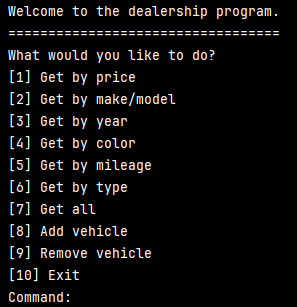
- **Find Vehicles by Price Range 💵**

- **Find Vehicles by Make/Model 🏎️**

| 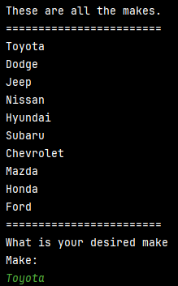 | 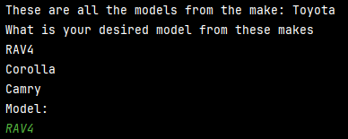 |
|:---------------------:|:---------------------:|
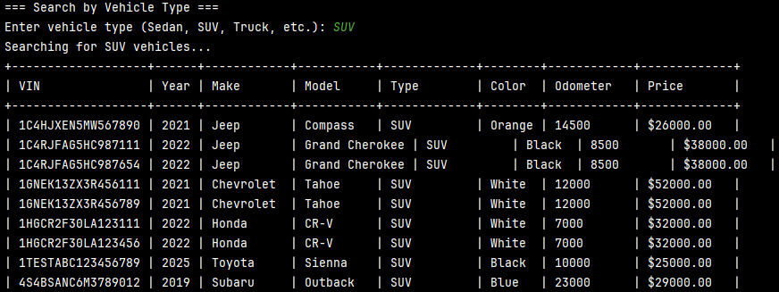

- **Find Vehicles by Year Range 📅**

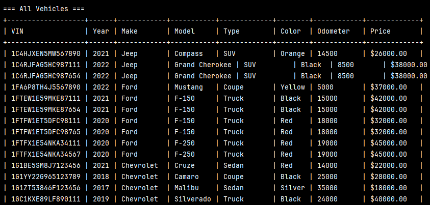
- **Find Vehicles by Color 🎨**

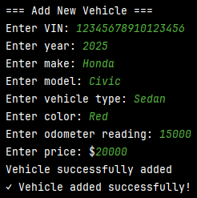

- **Find Vehicles by Mileage Range 🛣️**

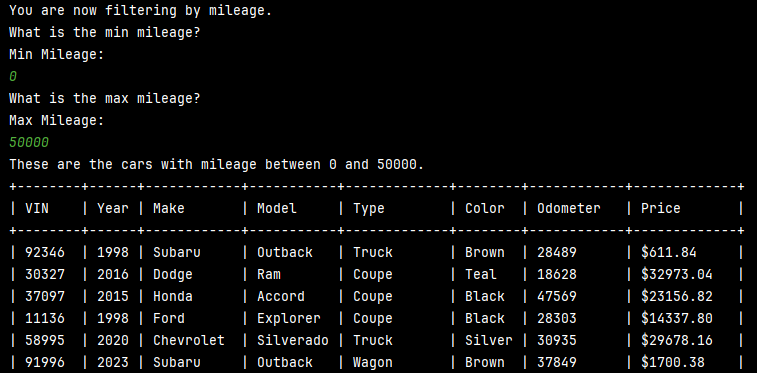
- **Find Vehicles by Type 🚘**

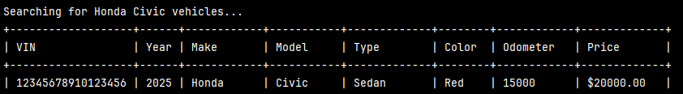
- **List All Vehicles 📜**

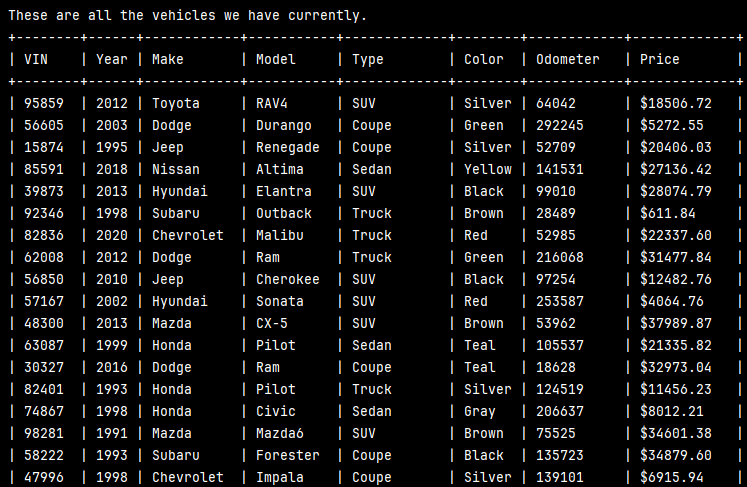
- **Add a Vehicle ➕**

| 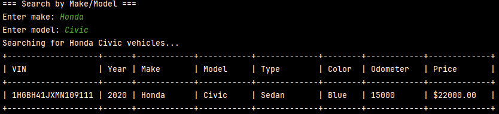 | 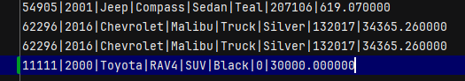 |
|:---------------------:|:---------------------:|
- **Remove a Vehicle ➖**

| 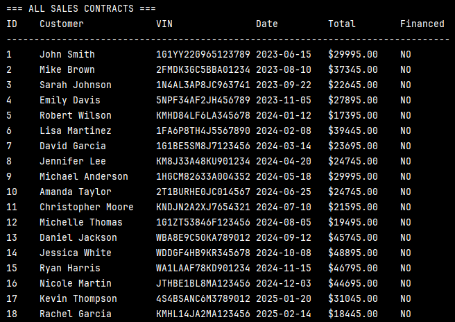 | 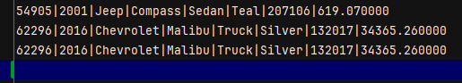 |
|:---------------------:|:---------------------:|
- **Saves the dealership after any updates to it 💾**

---
## 🚀 How to Run

> ✅ Make sure you’re using **Java 17 or higher**.  
> 📂 The program will read from and write to a file named `transactions.csv` in the root directory.
1. **Clone the repository**

   **paste this to into your IDE of chose to clone**

   https://github.com/kennylin894/workshopFour_carDealership.git

2. Navigate to Main and run the program

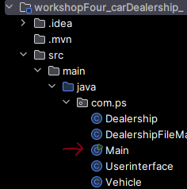

3.Make sure your data in inventory.csv is in this format  
First Line has to dealsership information

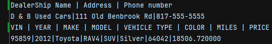

--------

## 🙌 Final Notes
Thank you for checking out the Dealership Application!  
Feel free to fork, clone, and expand upon it. 🛠️

----

## 📫 Contact & Socials

- **Email**: klin@appdev.yearup.org
- **GitHub**: [@Kennylin894](https://github.com/kennylin894)
- **LinkedIn**: [@kennay-lin](https://www.linkedin.com/in/kennay-lin/)

#   w o r k s h o p F i v e _ c a r D e a l e r s h i p O O P 
 
 