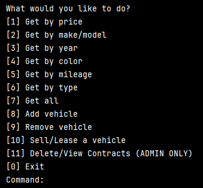
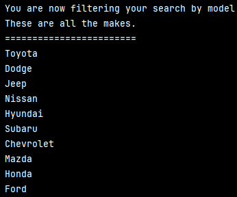
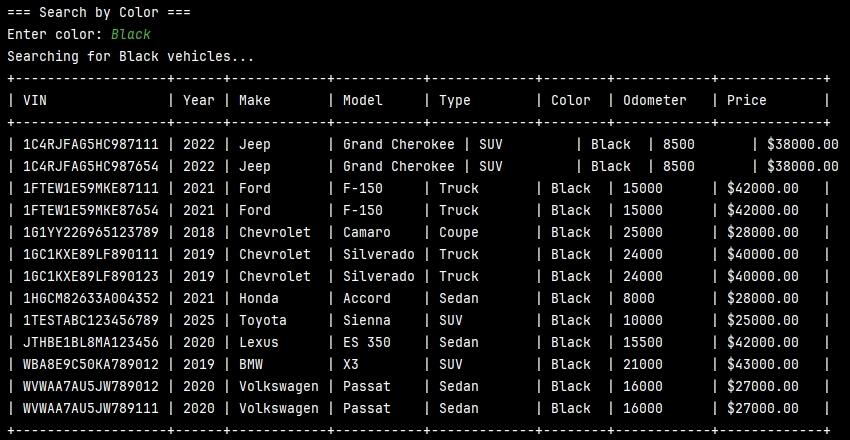
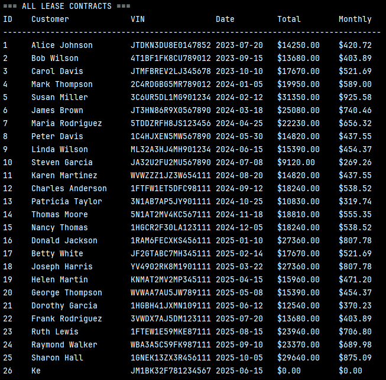

# Car Dealership Application 🚗🚙
By: Kenny Lin 

Welcome to the **Car Dealership Application**! This is a simple console-based application that simulates the operations
of a car dealership.
The application allows users to interact with a list of vehicles by performing various operations like searching, adding
, and removing vehicles while the implmentation of a sql database.

## 📝 Features

- **Interactive Main menu 🎮**

- **Find Vehicles by Price Range 💵**

- **Find Vehicles by Make/Model 🏎️**

- **Find Vehicles by Year Range 📅**

- **Find Vehicles by Color 🎨**

- **Find Vehicles by Mileage Range 🛣️**

- **Find Vehicles by Type 🚘**

- **List All Vehicles 📜**

- **Add a Vehicle ➕**

- **Remove a Vehicle ➖**

Saves the dealership after any updates to it 💾

- **Sell/Lease a Vehicle**

Save Sales and Lease Contracts to the sql database 🧾

- **View/Delete Sale/Lease Contracts (ADMIN ONLY)**

how to view

Sales Contracts

Lease Contracts

---
## 🚀 How to Run

> ✅ Make sure you’re using **Java 17 or higher**.
1. **Clone the repository**

   **paste this to into your IDE of chose to clone**

   https://github.com/kennylin894/workshopEight_carDealershipJDBC.git

2. Navigate to Main and run the program

--------

## 🙌 Final Notes
Thank you for checking out the Dealership Application!  
Feel free to fork, clone, and expand upon it. 🛠️

----

## 📫 Contact & Socials

- **Email**: klin@appdev.yearup.org
- **GitHub**: [@Kennylin894](https://github.com/kennylin894)
- **LinkedIn**: [@kennay-lin](https://www.linkedin.com/in/kennay-lin/)
 
 